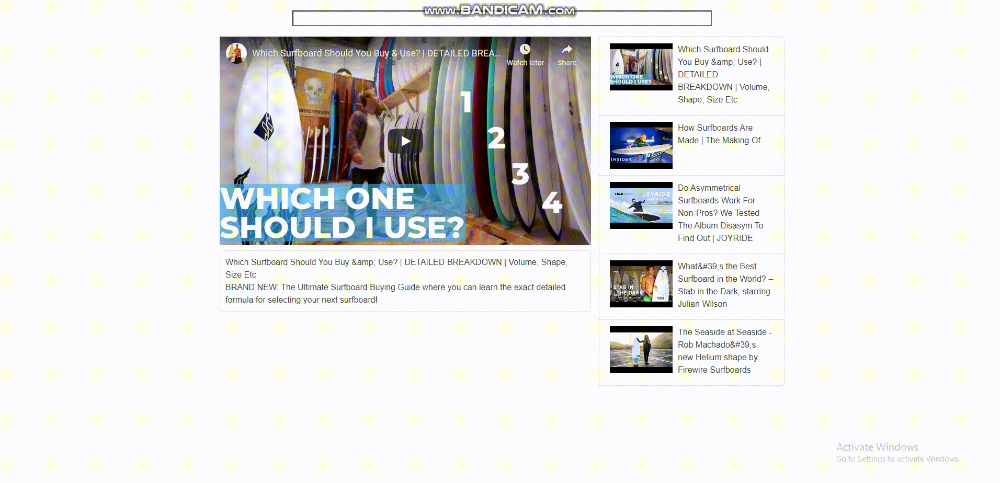

# clonetube-react

### 0. Purpose

Udemy 강좌 <a href="https://www.udemy.com/course/react-redux-korean/">"모던 리액트(React)와 리덕스(Redux)"</a> Section 2까지의 결과물입니다.

### 1. Features
- YouTube 동영상 목록 조회
- YouTube 동영상 동영상 시청
- YouTube 동영상 동영상 검색

### 2. How to use
1. <a href="https://13circle.github.io/clonetube-react/">해당 repo의 GitHub Page</a>로 접속합니다.
2. 원하는 동영상을 검색하면 검색어에 맞게 목록이 갱신됩니다.
3. 목록에서 원하는 동영상을 클릭하여 시청합니다.

### 3. Development Stack
- React
  - React 기초 튜토리얼이기에 사용되었습니다.
- YouTube Data API v3
  - YouTube 동영상 목록을 불러오기 위해서 사용되었습니다.

